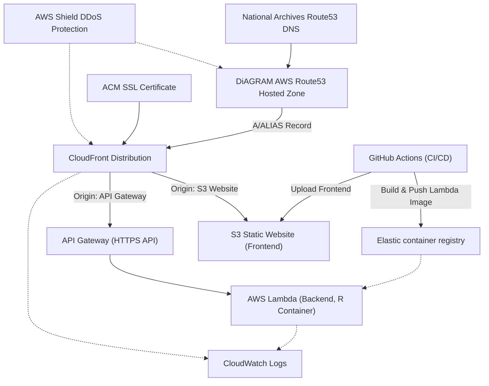

# DiAGRAM

## Runbook

### What is DiAGRAM? What is its purpose?
DiAGRAM stands for the **Digital Archiving Graphical Risk Assessment Model**. It is an **online tool designed to help archivists manage the risks to their digital collections**. By answering a set of questions about their archive (such as storage media, system security, and technical skills), users receive a quantitative risk assessment regarding the preservation of their digital material. The model calculates probabilities relating to archival outcomes using a **Bayesian network**, making it the first tool to apply a quantitative, statistical approach for digital preservation risk assessment.

For archivists, DiAGRAM helps explain:
- The risks involved in digital preservation and how risk events are linked
- How potential decisions or collection changes may affect risk

### How business critical is it?
- DiAGRAM is developed by [The National Archives](https://www.nationalarchives.gov.uk/) and the [University of Warwick](https://warwick.ac.uk/fac/sci/statistics/asru), supported by external funders.
- While impactful for digital preservation and risk assessment in archives (especially for institutional users), it is offered as **free to use for non-commercial purposes**. Individual institutions’ business criticality will depend on their usage patterns and needs.

### Where is it hosted?
DiAGRAM is hosted in the **AWS cloud (eu-west-2 region)**. The infrastructure is codified using Terraform and deployed as follows:
- **Frontend:** Hosted as a static website on AWS S3, served via AWS CloudFront (CDN)
- **Backend:** Runs as a custom AWS Lambda Function (containerised), exposed via AWS API Gateway
- **DNS:** Managed via AWS Route53, under `diagram.nationalarchives.gov.uk`

### Who owns it? Who operates it?
- **Primary ownership:** The University of Warwick (as per copyright)
- **Project and operational leadership:** The National Archives, UK
- **Infrastructure management:** The National Archives team and partners

## Architecture

### Diagram

### What components are used?
**Infrastructure components (AWS Cloud):**
- S3: Static hosting for frontend
- CloudFront: CDN for frontend and backend, provides global cache and HTTPS
- Route53: DNS, hosted zone for `diagram.nationalarchives.gov.uk`
- Lambda (container-based): Runs custom R (via Docker image) API backend
- API Gateway: Receives and routes API requests to Lambda backend
- ACM (AWS Certificate Manager): `diagram.nationalarchives.gov.uk` HTTPS certificate loaded by The National Archives
- CloudWatch: Logging for Lambda and CloudFront
- IAM: Permissions for CI/CD (GitHub Actions, Lambda, etc.)
- AWS Shield: DDoS protection for Route53 and CloudFront

**Application Code:**
- Backend: R in a Lambda container image (supports R Markdown and LaTeX for report generation)
- Frontend: Static HTML/JS

### How does the DNS work?
- **Domains:** The main site is `diagram.nationalarchives.gov.uk`. There is a dev environment `dev-diagram.nationalarchives.gov.uk` but this is only created during a deployment to run tests against.
- **Route53** is used for each environment as the authoritative DNS provider, with delegated NS records set by The National Archives.
- Each environment creates its own Route53 hosted zone. TNA delegates the domain from their parent zone using the NS values from Route53.
- **A records** (type `A`) are created as alias records that point to the CloudFront distribution.

### Where does the HTTPS certificate come from?
- **Certificate:** A certificate for `diagram.nationalarchives.gov.uk` is deployed in the North Virginia region in AWS Certificate Manager.
- **Use:** The certificate is used by CloudFront to serve HTTPS.
- **Access:** The certificate is only available within AWS.

## Deployment

### How is DiAGRAM deployed?

#### Infrastructure

The infrastructure (networking, frontend/CDN, backend Lambda/API, IAM, DNS, etc.) is defined and deployed with [Terraform](https://github.com/nationalarchives/DiAGRAM-terraform/)  
The 

#### Backend code updates

1. The GitHub actions workflow is triggered on changes to the `api/` directory.
2. The docker image is built and scanned by Wiz
3. A new patch version is generated and the image is tagged with this new version and pushed to ECR.
4. This image is tagged with the `dev` tag and pushed. 
5. The HEAD of the `live` branch is tagged with `release-dev`
6. The [General release](#general-release) process is triggered.

#### Frontend code updates
1. The GitHub actions workflow is triggered on changes to the `app/` directory.
2. The [General release](#general-release) process is triggered.

#### General release
1. AWS credentials are created using the workflow token and `AssumeRoleWithWebIdentity`
2. The dev environment is created using terraform.
3. The workflow waits for the DNS for `dev-diagram.nationalarchives.gov.uk` to become available.
4. The [e2e tests](./tests/cypress) are run against the dev instance. If they fail, a message is sent to Slack and the workflow finishes. Otherwise is continues.
5. The dev environment is destroyed by running `terraform destroy`
6. The docker image with the `dev` tag is pulled and tagged with `live`
7. The `live` tagged image is pushed to ECR.
8. Terraform is used to deploy the changes to the `live` site.

#### Automatic release of dependabot updates
Dependabot is used to create pull requests for updates to the npm and GitHub actions dependencies.
These are merged automatically using Mergify which then triggers the release. 
The automatic merge only happens if the author is the dependabot and the Wiz security scans pass. 