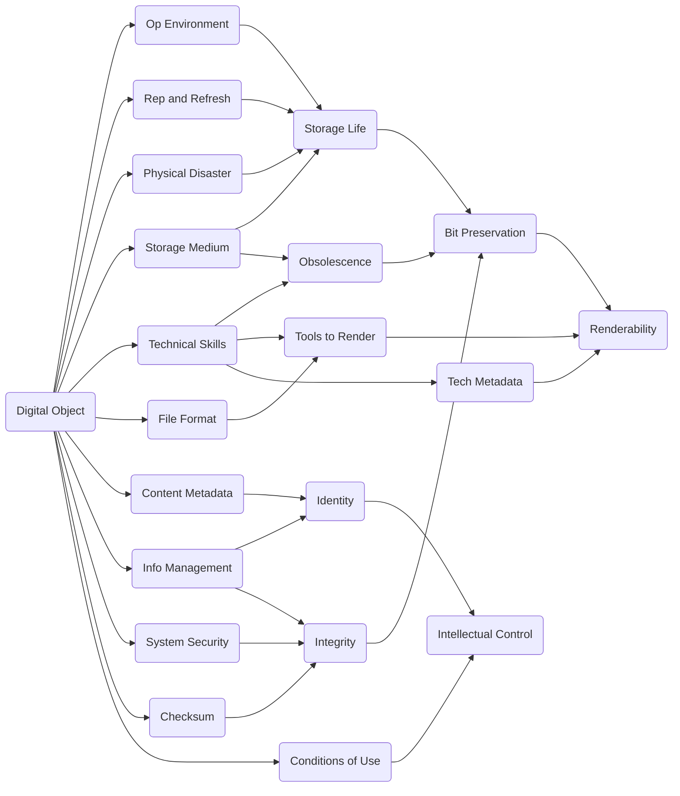
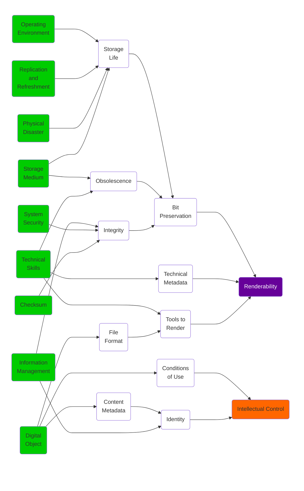

```mermaid
graph LR
do(Digital Object)

do --> oe(Op Environment)
do --> rr(Rep and Refresh)
do --> pd(Physical Disaster)
do --> sm(Storage Medium)
do --> ts(Technical Skills)
do --> ff(File Format)
do --> cm(Content Metadata)
do --> im(Info Management)
do --> ss(System Security)
do --> cx(Checksum)

oe --> sl(Storage Life)
rr --> sl
pd --> sl
sm --> sl
sm --> ox(Obsolescence)
ts --> ox
ts --> tr(Tools to Render)
ff --> tr
do --> cu(Conditions of Use)
cm --> id(Identity)
im --> id
im --> ix(Integrity)
ss --> ix
cx --> ix

sl --> bp(Bit Preservation)
ox --> bp
ix --> bp
ts --> tm(Tech Metadata)
cu --> ic(Intellectual Control)
id --> ic
bp --> rx(Renderability)
tm --> rx
tr --> rx
```


```mermaid
graph LR

subgraph A
    oe("Operating<br>Environment")
    rr(Replication<br>and<br>Refreshment)
    pd(Physical<br>Disaster)
    sm(Storage<br>Medium)
    ts(Technical<br>Skills)
    do(Digital<br>Object)
    im(Information<br>Management)
    ss(System<br>Security)
    cx(Checksum)
end

style oe fill:#0c0
style rr fill:#0c0
style pd fill:#0c0
style sm fill:#0c0
style ts fill:#0c0
style do fill:#0c0
style im fill:#0c0
style ss fill:#0c0
style cx fill:#0c0

style ff fill:#fff

subgraph C
	do --> ff(File<br>Format)

    oe --> sl(Storage<br>Life)
    rr --> sl
    pd --> sl
    sm --> sl
    sm --> ox(Obsolescence)
    ts --> ox
    ts --> tr(Tools to<br>Render)
    ff --> tr
    ts --> tm(Technical<br>Metadata)
    do --> cu(Conditions<br>of Use)
    do --> cm(Content<br>Metadata)
    im --> ix(Integrity)
    ss --> ix
    cx --> ix
    
    sl --> bp(Bit<br>Preservation)
    ox --> bp
    ix --> bp
    cm --> id(Identity)
    im --> id
end

style sl fill:#fff
style ox fill:#fff
style tr fill:#fff
style tm fill:#fff
style cu fill:#fff
style cm fill:#fff
style ix fill:#fff

style bp fill:#fff
style id fill:#fff

subgraph E
bp --> rx(Renderability)
tm --> rx
tr --> rx
cu --> ic(Intellectual Control)
id --> ic
end

style rx fill:#609,color:#fff
style ic fill:#f60

style A fill:none,stroke:none,color:transparent
style C fill:none,stroke:none,color:transparent
style E fill:none,stroke:none,color:transparent

```

```js
// https://github.com/mermaid-js/mermaid/issues/580#issuecomment-373929046
mermaid.initialize({
  flowchart: { 
    curve: 'basis' 
  }
});
```