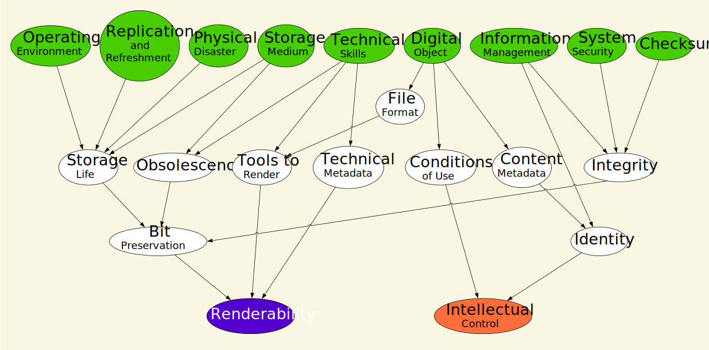

## Learn about DiAGRAM

DiAGRAM tells you how well you are managing your digital preservation risks. It does this by calculating two probabilities: 

1. intellectual control defined as the probability that you have full knowledge of the file’s content, provenance and conditions of use
2. renderability defined as the probability that you can provide a sufficiently useful representation of the original file

You can then use DiAGRAM to explore how these probabilities would change if you made different decisions or your collection changed. 
This tool uses a statistical method called a Bayesian network to quantify digital preservation risks. This method uses probability to consider the conditional relationships between the nodes (things like System Security and Technical Skills) to compute the probability of risk events occuring.

 
The Bayesian network consists of nodes which define the various factors that affect the preservation of digital material. 

For example, by looking at the picture of the network you can see that improving Storage Medium will impact Renderability but improving Information Management will impact Intellectual Control. 

For every node there are probabilities assigned to each of their possible states taken from existing data where it was available. As historical data were not available for some risks, the probabilities were established using a formal expert elicitation procedure involving a number of UK digital archivists and preservation experts.

These probabilities are used to calculate the final two probabilities of having full intellectual control and renderability of your digital material, the two key factors in the successful preservation of digital material. 

For a more technical explanation of the methodology, see this paper from Barons, Wright and Smith on <a href = "https://warwick.ac.uk/fac/sci/statistics/crism/research/16-5w.pdf" target="_blank">Eliciting Probabilistic Judgement for Integrated Decision Support Systems</a> with an example of Food Security. 

You can explore how the network works and the data we have used in more depth on the Advanced Customisation page. Here you can also update the probability tables with your data for the other nodes (the ones you do not provide data for by answering the questions). This allows you to create a more bespoke model. The advanced option does assume you are familiar with conditional and marginal probabilities and the theory behind a Bayesian network.
